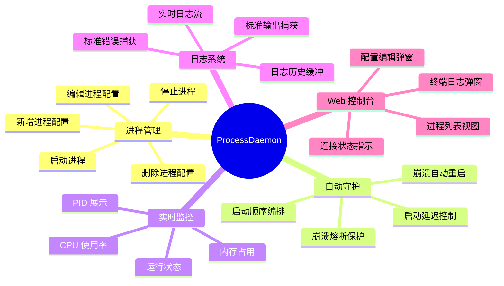

# ProcessDaemon 产品需求文档 (PRD)

> **文档版本**：v1.0  
> **最后更新**：2026-04-22  
> **产品负责人**：—  
> **状态**：已发布

---

## 一、产品概述

### 1.1 产品名称

ProcessDaemon — 轻量级 .NET 进程守护与监控平台

### 1.2 产品定位

面向中小规模 .NET 微服务部署场景的**进程生命周期管理工具**。在不引入 Kubernetes、Docker Compose 等重型编排平台的前提下，提供一个单体化、零外部依赖的进程守护方案，支持通过 Web 控制台进行可视化管理。

### 1.3 目标用户

| 用户角色 | 使用场景 |
|----------|----------|
| 运维工程师 | 在裸机 / 虚拟机上部署和监控多个 .NET 服务 |
| 后端开发者 | 开发环境中同时启动多个依赖服务进行联调 |
| 项目经理 | 通过 Web 控制台快速了解各子系统运行状态 |

### 1.4 产品愿景

> 用一个 DLL 守护所有 DLL。

以最小的部署成本，让多个 .NET 服务在同一台机器上具备**自动拉起、崩溃熔断、资源监控、实时日志**四大核心能力。

---

## 二、核心目标

| 编号 | 目标 | 度量指标 |
|:----:|------|----------|
| G1 | 零依赖部署 | 仅需 .NET Runtime，无需数据库、Redis、消息队列 |
| G2 | 进程自动恢复 | 崩溃后 ≤3 秒自动重启，60 秒内崩溃 ≥5 次触发熔断 |
| G3 | 实时可观测 | CPU、内存指标每 3 秒刷新，日志实时流式推送 |
| G4 | Web 可视化管理 | 通过浏览器完成所有进程的 CRUD 和启停操作 |
| G5 | 配置持久化 | 进程配置保存为 JSON 文件，服务重启后自动恢复 |

---

## 三、功能需求

### 3.1 功能全景图

### 3.2 功能优先级

| 优先级 | 功能 | 描述 |
|:------:|------|------|
| P0 | 进程启停管理 | 通过 Web UI 或 API 启动 / 停止任意已配置的进程 |
| P0 | 崩溃自动重启 | 检测到进程退出后自动重新拉起 |
| P0 | 熔断保护 | 60 秒内崩溃 ≥5 次后停止自动重启，防止重启风暴 |
| P0 | 配置 CRUD | 支持通过 Web UI 新增、编辑、删除进程配置 |
| P0 | JSON 持久化 | 配置保存到 `processes.json`，服务重启后自动加载 |
| P1 | CPU / 内存监控 | 每 3 秒采集一次正在运行进程的资源使用情况 |
| P1 | 实时日志流 | 通过 WebSocket 将进程标准输出 / 错误实时推送到浏览器 |
| P1 | 启动顺序编排 | 按配置顺序依次启动进程，每个进程启动后等待指定延迟 |
| P2 | 日志历史缓冲 | 保留最近 100 条日志，后连接的客户端可获取历史日志 |
| P2 | 连接状态指示 | 前端实时显示与后端的 WebSocket 连接状态 |
| P2 | 秒退检测 | 进程启动后 500ms 内退出视为启动失败，准确反馈状态 |

### 3.3 用户故事

| 编号 | 用户故事 | 验收标准 |
|:----:|----------|----------|
| US-01 | 作为运维，我要通过 Web 界面添加一个新的 .NET 服务，这样无需修改配置文件 | 填写 ID、名称、DLL 路径、参数、延迟后保存，列表中立即出现新条目 |
| US-02 | 作为运维，我要在浏览器中一键启动 / 停止指定进程 | 点击启动按钮后进程开始运行并显示 PID，点击停止后进程终止 |
| US-03 | 作为运维，当某个服务崩溃后，系统应自动将其重新拉起 | 进程异常退出后 ≤3 秒内自动重启，无需人工干预 |
| US-04 | 作为运维，当服务反复崩溃时，系统应停止重启并告警 | 60 秒内崩溃 5 次后触发熔断，状态显示为"已熔断" |
| US-05 | 作为开发者，我要查看某个服务的实时日志输出 | 点击"终端"按钮弹出终端窗口，实时滚动显示日志 |
| US-06 | 作为运维，我要查看各服务的 CPU 和内存使用情况 | 列表中每 3 秒刷新一次 CPU% 和内存 MB |
| US-07 | 作为运维，我修改了配置后，正在运行的进程应提示需要重启 | 编辑正在运行的进程配置后，返回提示"重启后生效" |

---

## 四、非功能需求

| 编号 | 类别 | 需求描述 |
|:----:|------|----------|
| NFR-01 | 性能 | 同时管理 ≤50 个进程时，Web 控制台响应时间 ≤200ms |
| NFR-02 | 可靠性 | 守护进程自身需作为 systemd 服务运行，异常退出后由系统自动恢复 |
| NFR-03 | 可用性 | Web 控制台需在主流浏览器（Chrome、Edge、Firefox）中正常使用 |
| NFR-04 | 可维护性 | 所有配置存储为人类可读的 JSON 文件，支持手动编辑 |
| NFR-05 | 安全性 | 生产环境部署时需配置 IP 白名单或认证机制（当前版本待实现） |
| NFR-06 | 部署 | 支持 Linux（systemd）和 Windows 部署 |

---

## 五、技术约束

| 约束项 | 说明 |
|--------|------|
| 运行时 | .NET 7.0 Runtime（建议升级至 .NET 8 LTS） |
| 持久化 | 仅使用本地 JSON 文件，不引入数据库 |
| 通信协议 | REST API（配置管理）+ SignalR WebSocket（实时推送） |
| 前端 | 纯 HTML + CSS + JavaScript 单文件，无前端框架依赖 |
| 被管理进程 | 限于 `dotnet <DLL>` 可启动的 .NET 应用 |

---

## 六、里程碑规划

| 阶段 | 内容 | 状态 |
|:----:|------|:----:|
| v1.0 | 核心功能：启停管理、自动重启、熔断、Web 控制台 | ✅ 已完成 |
| v1.1 | 秒退检测修复、启动失败准确状态反馈 | ✅ 已完成 |
| v2.0 | 认证鉴权、健康检查端点、.NET 8 升级 | 📋 待规划 |
| v2.1 | 日志持久化到文件、日志搜索、告警通知集成 | 📋 待规划 |

---

## 七、风险与缓解

| 风险 | 影响 | 缓解措施 |
|------|------|----------|
| 无认证机制 | 任何可访问网络的人均可操控进程 | v2.0 中加入 API Key / IP 白名单 |
| JSON 文件损坏 | 配置丢失导致所有进程无法恢复 | 改用原子写入（先写临时文件再 rename） |
| .NET 7 已 EOL | 不再接收安全补丁 | 升级至 .NET 8 LTS |
| 单点故障 | ProcessDaemon 自身崩溃后所有子进程无人看管 | 使用 systemd Restart=always 兜底 |
