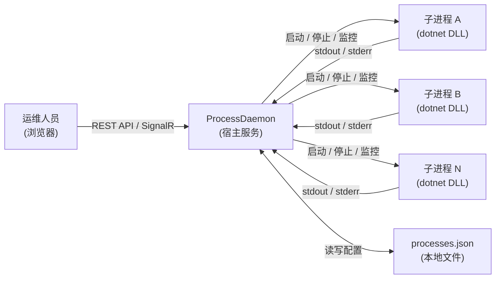
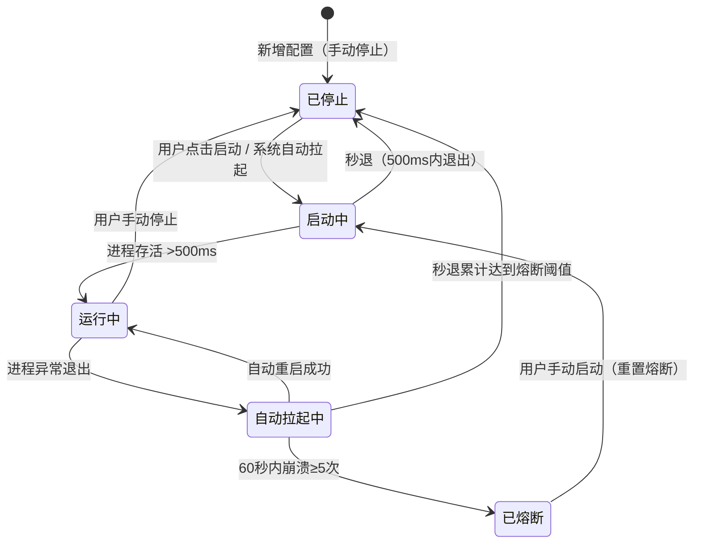

# ProcessDaemon 需求规格说明书

> **文档版本**：v1.0  
> **最后更新**：2026-04-22  
> **状态**：已发布

---

## 一、文档范围

本文档详细描述 ProcessDaemon 系统的功能需求与接口规格，作为开发、测试和验收的依据。

---

## 二、系统总体描述

### 2.1 系统上下文



### 2.2 术语定义

| 术语 | 定义 |
|------|------|
| 子进程 | 由 ProcessDaemon 通过 `dotnet <DllPath>` 启动的 .NET 应用程序实例 |
| 进程配置 | 描述一个子进程的静态信息：ID、名称、DLL 路径、启动参数、启动延迟 |
| 进程状态 | 子进程的运行时信息：PID、IsRunning、CPU、内存、是否手动停止、是否熔断 |
| 熔断 | 当进程在 60 秒内崩溃 ≥5 次时，系统停止自动重启并标记为"已熔断"状态 |
| 秒退 | 进程启动后在 500ms 内退出，判定为启动失败 |

---

## 三、功能需求

### 3.1 进程配置管理

#### FR-01 新增进程配置

| 项目 | 描述 |
|------|------|
| 触发条件 | 用户在 Web 控制台点击"新增进程"并填写表单提交 |
| 输入 | ID（唯一标识）、名称、DLL 路径、启动参数（可选）、启动延迟（默认 5000ms） |
| 处理逻辑 | 1. 对所有字段执行 Trim 规范化<br/>2. 校验 ID、名称、DLL 路径不为空<br/>3. 校验 ID 不重复<br/>4. 校验启动延迟 ≥ 0<br/>5. 持久化到 `processes.json`<br/>6. 新建进程条目设置为"手动停止"状态 |
| 输出 | 返回创建的配置对象，HTTP 201 |
| 异常 | 校验失败返回 HTTP 400 + 错误信息 |

#### FR-02 编辑进程配置

| 项目 | 描述 |
|------|------|
| 触发条件 | 用户在列表中点击"编辑"，修改表单后提交 |
| 输入 | 与新增相同，但 ID 不可修改 |
| 处理逻辑 | 1. URL 中的 ID 必须与请求体中的 ID 一致<br/>2. 执行与新增相同的校验<br/>3. 更新内存中的配置<br/>4. 持久化到 `processes.json`<br/>5. 若进程正在运行，返回 `restartRequired: true` |
| 输出 | 返回更新后的配置 + 是否需要重启，HTTP 200 |
| 异常 | ID 不存在返回 HTTP 404；校验失败返回 HTTP 400 |

#### FR-03 删除进程配置

| 项目 | 描述 |
|------|------|
| 触发条件 | 用户在列表中点击"删除"并确认 |
| 输入 | 进程 ID |
| 处理逻辑 | 1. 查找进程，如不存在返回 404<br/>2. 若进程正在运行，先停止（Kill 整个进程树）<br/>3. 从内存列表中移除<br/>4. 持久化到 `processes.json`<br/>5. 广播最新状态 |
| 输出 | HTTP 200 + 删除成功消息 |

#### FR-04 查询所有进程配置

| 项目 | 描述 |
|------|------|
| 触发条件 | Web 控制台页面加载时 / 配置变更后 |
| 输出 | 所有进程配置的列表 |

---

### 3.2 进程生命周期管理

#### FR-05 启动进程

| 项目 | 描述 |
|------|------|
| 触发条件 | 用户点击"启动"按钮 / 系统自动重启 |
| 处理逻辑 | 1. 清理旧进程句柄<br/>2. 创建 `ProcessStartInfo`，FileName=`dotnet`，Arguments=`<DllPath> <Arguments>`<br/>3. 重定向 stdout / stderr，编码设为 UTF-8<br/>4. 启动进程，注册输出/错误回调<br/>5. **等待 500ms 进行秒退检测**<br/>6. 若进程在 500ms 内退出，判定为启动失败，清除进程引用<br/>7. 广播最新状态 |
| 输出 | 成功：进程进入"运行中"状态<br/>失败：进程保持"已停止"状态，日志输出错误信息 |

#### FR-06 停止进程

| 项目 | 描述 |
|------|------|
| 触发条件 | 用户点击"停止"按钮 / 删除进程时 |
| 处理逻辑 | 1. 标记为"手动停止"<br/>2. 调用 `Process.Kill(entireProcessTree: true)` 终止整个进程树<br/>3. 释放进程句柄<br/>4. 清除 CPU/内存指标<br/>5. 广播最新状态 |

#### FR-07 崩溃自动重启

| 项目 | 描述 |
|------|------|
| 触发条件 | 监控循环检测到进程已退出，且非手动停止、非熔断状态 |
| 处理逻辑 | 1. 清理 60 秒前的崩溃记录<br/>2. 记录本次崩溃时间<br/>3. 若 60 秒内崩溃次数 ≥5，触发熔断<br/>4. 否则执行 FR-05 启动进程<br/>5. 若启动后秒退，额外记录一次崩溃 |
| 检测频率 | 每 3 秒一次 |

#### FR-08 熔断保护

| 项目 | 描述 |
|------|------|
| 触发条件 | 60 秒内崩溃次数 ≥5 |
| 行为 | 1. 设置 `IsCircuitBroken = true`<br/>2. 停止对该进程的自动重启<br/>3. 记录 CRITICAL 级别日志<br/>4. 状态显示为"已熔断" |
| 解除方式 | 用户手动点击"启动"按钮 |

#### FR-09 顺序启动

| 项目 | 描述 |
|------|------|
| 触发条件 | ProcessDaemon 服务启动时 |
| 处理逻辑 | 按配置列表顺序依次启动所有非手动停止的进程，每个进程启动后等待其 `StartupDelayMs` 指定的时间再启动下一个 |

---

### 3.3 监控与日志

#### FR-10 资源监控

| 项目 | 描述 |
|------|------|
| 采集指标 | CPU 使用率（百分比）、内存占用（MB） |
| 采集方式 | CPU: 通过 `TotalProcessorTime` 差值 / （核心数 × 时间差）计算<br/>内存: 读取 `WorkingSet64` |
| 采集频率 | 每 3 秒采集一次 |
| 推送方式 | 通过 SignalR 向所有连接的客户端广播 `ReceiveStatuses` |

#### FR-11 实时日志流

| 项目 | 描述 |
|------|------|
| 日志来源 | 子进程的 stdout 和 stderr |
| 格式 | `[HH:mm:ss] <日志内容>`，stderr 前缀 `[ERROR]` |
| 缓冲区 | 每个进程保留最近 100 条日志（`ConcurrentQueue`） |
| 推送方式 | 通过 SignalR Group 按进程 ID 隔离推送 |
| 历史日志 | 客户端订阅时一次性获取缓冲区中的所有历史日志 |

---

### 3.4 配置持久化

#### FR-12 JSON 文件存储

| 项目 | 描述 |
|------|------|
| 文件路径 | `<ContentRoot>/processes.json` |
| 格式 | JSON 数组，camelCase 命名，缩进格式化 |
| 加载优先级 | 1. 读取 `processes.json`<br/>2. 若不存在，回退到 `appsettings.json` 中的 `ProcessConfig` 节<br/>3. 将回退数据写入 `processes.json` |
| 保存时机 | 每次新增、编辑、删除操作后立即保存 |

配置文件结构示例：

```json
[
  {
    "id": "data-collector-01",
    "name": "频谱数据采集服务",
    "dllPath": "Collector.dll",
    "arguments": "--port 5001",
    "startupDelayMs": 3000
  }
]
```

---

## 四、接口规格

### 4.1 REST API

基础路径：`/api/processes`

#### GET /api/processes

获取所有进程配置列表。

**Response 200：**
```json
[
  {
    "id": "data-collector-01",
    "name": "频谱数据采集服务",
    "dllPath": "Collector.dll",
    "arguments": "--port 5001",
    "startupDelayMs": 3000
  }
]
```

#### POST /api/processes

新增进程配置。

**Request Body：**
```json
{
  "id": "my-service-01",
  "name": "我的服务",
  "dllPath": "MyService.dll",
  "arguments": "--env production",
  "startupDelayMs": 5000
}
```

**Response 201：**
```json
{
  "message": "进程配置已保存。",
  "process": { /* ProcessConfigDto */ }
}
```

**Response 400：**
```json
{
  "message": "ID 已存在，请使用不同的 ID。"
}
```

#### PUT /api/processes/{id}

更新指定进程配置。

**Response 200：**
```json
{
  "message": "配置已保存，重启后生效。",
  "restartRequired": true,
  "process": { /* ProcessConfigDto */ }
}
```

#### DELETE /api/processes/{id}

删除指定进程配置。若进程正在运行，先停止再删除。

**Response 200：**
```json
{
  "message": "进程配置已删除。"
}
```

**Response 404：**
```json
{
  "message": "未找到对应的进程配置。"
}
```

---

### 4.2 SignalR Hub

Hub 路径：`/monitor`

#### 服务端 → 客户端事件

| 事件名 | 参数 | 触发时机 |
|--------|------|----------|
| `ReceiveStatuses` | `ProcessStatusDto[]` | 每 3 秒广播一次；连接建立时推送一次；启停操作后推送一次 |
| `ReceiveHistoryLogs` | `(string id, string[] logs)` | 客户端订阅日志时返回历史缓冲 |
| `ReceiveLog` | `(string id, string logText)` | 子进程有新的 stdout/stderr 输出时 |

#### 客户端 → 服务端方法

| 方法名 | 参数 | 功能 |
|--------|------|------|
| `StartProcess` | `string id` | 启动指定进程 |
| `StopProcess` | `string id` | 停止指定进程 |
| `SubscribeLogs` | `string id` | 加入指定进程的日志组，接收实时日志 |
| `UnsubscribeLogs` | `string id` | 退出指定进程的日志组 |

#### ProcessStatusDto 数据结构

```json
{
  "id": "data-collector-01",
  "name": "频谱数据采集服务",
  "pid": 12345,
  "isRunning": true,
  "isManuallyStopped": false,
  "isCircuitBroken": false,
  "cpuUsage": 2.5,
  "memoryMb": 128.3
}
```

---

## 五、进程状态机



### 状态说明

| 状态 | 条件 | UI 显示 |
|------|------|---------|
| 运行中 | `IsRunning = true` | 绿色 badge |
| 已停止 | `IsManuallyStopped = true` | 灰色 badge |
| 自动拉起中 | 非运行、非手动停止、非熔断 | 黄色 badge |
| 已熔断 | `IsCircuitBroken = true` | 紫色 badge |

---

## 六、数据字典

### 6.1 ProcessConfigDto

| 字段 | 类型 | 必填 | 默认值 | 说明 |
|------|------|:----:|--------|------|
| id | string | ✅ | — | 进程唯一标识，不可重复 |
| name | string | ✅ | — | 进程显示名称 |
| dllPath | string | ✅ | — | .NET DLL 文件路径（相对或绝对） |
| arguments | string | ❌ | `""` | 启动参数 |
| startupDelayMs | int | ✅ | `5000` | 启动后等待就绪的时间（毫秒），≥0 |

### 6.2 ProcessStatusDto

| 字段 | 类型 | 说明 |
|------|------|------|
| id | string | 进程 ID |
| name | string | 进程名称 |
| pid | int? | 操作系统进程 ID，未运行时为 null |
| isRunning | bool | 是否正在运行 |
| isManuallyStopped | bool | 是否被手动停止 |
| isCircuitBroken | bool | 是否已触发熔断 |
| cpuUsage | double | CPU 使用率（%） |
| memoryMb | double | 内存占用（MB） |

---

## 七、校验规则

| 字段 | 规则 |
|------|------|
| id | 不为空，不包含前后空格（自动 Trim），全局唯一 |
| name | 不为空 |
| dllPath | 不为空 |
| startupDelayMs | ≥ 0 |
| URL 路径 id | 必须与请求体中的 id 一致（PUT 请求） |
