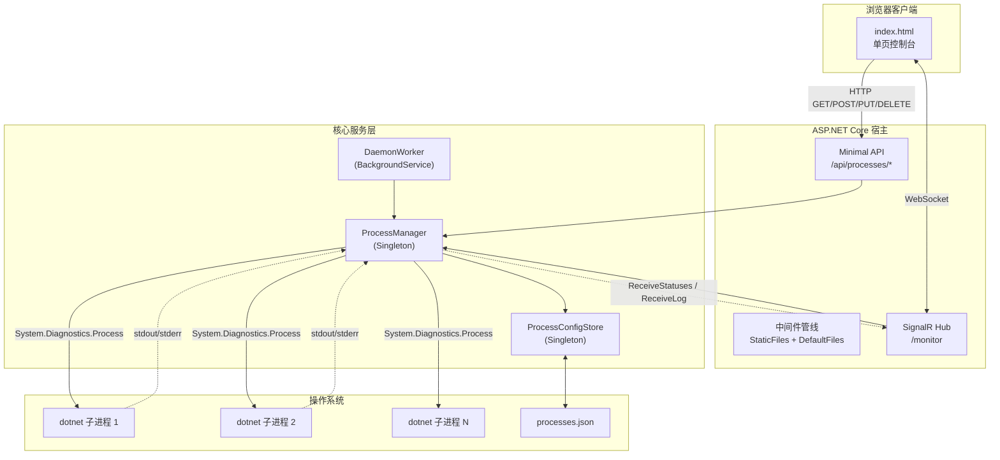
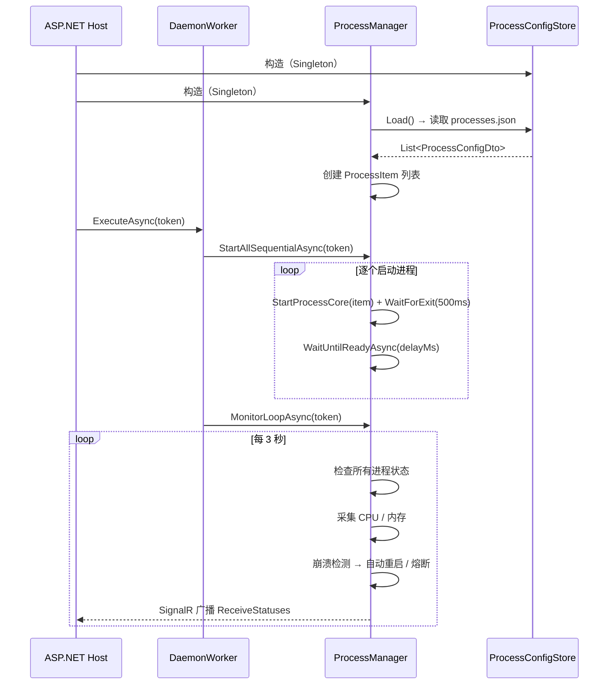

# ProcessDaemon 开发文档

> **文档版本**：v1.0  
> **最后更新**：2026-04-22  
> **目标读者**：项目开发者、维护者  
> **状态**：已发布

---

## 一、技术栈

| 层级 | 技术 | 版本 |
|------|------|------|
| 运行时 | .NET | 7.0（建议升级至 8.0 LTS） |
| Web 框架 | ASP.NET Core Minimal API | 随 .NET SDK |
| 实时通信 | SignalR | 随 ASP.NET Core |
| 前端 | 原生 HTML + CSS + JavaScript | — |
| 持久化 | 本地 JSON 文件 | — |
| 包管理 | NuGet | — |

**外部依赖：无。** 项目未引入任何第三方 NuGet 包，完全基于 .NET SDK 内置组件。

---

## 二、项目结构

```
ProcessDaemon/
├── Program.cs                  # 应用入口 & Minimal API 路由定义
├── ProcessDaemon.csproj        # 项目配置文件
├── ProcessDaemon.sln           # 解决方案文件
│
├── Models/
│   └── ProcessDtos.cs          # DTO 数据传输对象定义
├── ProcessItem.cs              # 运行时进程模型（含进程句柄和监控状态）
│
├── Services/
│   └── ProcessConfigStore.cs   # JSON 文件读写（配置持久化层）
├── ProcessManager.cs           # 核心服务（进程管理 + 监控 + 日志）
│
├── MonitorHub.cs               # SignalR Hub（实时通信端点）
├── DaemonWorker.cs             # 后台守护任务（启动 + 监控循环）
│
├── wwwroot/
│   └── index.html              # Web 控制台前端（CSS + JS 内联）
│
├── appsettings.json            # 应用配置（含初始进程配置模板）
├── appsettings.Development.json
├── processes.json              # 运行时进程配置文件（自动生成）
├── manage_service.sh           # Linux systemd 服务管理脚本
│
└── Properties/
    └── launchSettings.json     # 开发环境启动配置
```

---

## 三、架构设计

### 3.1 整体架构



### 3.2 服务生命周期



### 3.3 依赖注入配置

```csharp
// Program.cs
builder.Services.AddSignalR();
builder.Services.AddSingleton<ProcessConfigStore>();  // 配置持久化
builder.Services.AddSingleton<ProcessManager>();       // 核心管理器
builder.Services.AddHostedService<DaemonWorker>();     // 后台守护
```

- `ProcessConfigStore`：Singleton，负责 `processes.json` 的读写
- `ProcessManager`：Singleton，持有所有 `ProcessItem` 的内存列表
- `DaemonWorker`：BackgroundService，驱动启动和监控循环

---

## 四、核心模块详解

### 4.1 ProcessManager — 核心管理器

**文件**：`ProcessManager.cs` (~583 行)

**职责**：

| 功能域 | 关键方法 |
|--------|----------|
| 启动管理 | `StartAllSequentialAsync()` — 按序启动所有进程 |
| 监控循环 | `MonitorLoopAsync()` — 3 秒轮询，采集指标、检测崩溃、自动重启 |
| CRUD | `CreateProcessAsync()` / `UpdateProcessAsync()` / `DeleteProcessAsync()` |
| 启停控制 | `StartProcessAsync()` / `StopProcessAsync()` |
| 状态查询 | `GetStatusSnapshotsAsync()` / `GetProcessConfigsAsync()` / `GetRecentLogsAsync()` |
| 内部核心 | `StartProcessCore()` — 实际的进程创建 + 秒退检测 |
| | `StopProcessCore()` — Kill 进程树 + 清理句柄 |
| | `CalculateResourceUsage()` — CPU/内存指标采集 |
| | `HandleLogOutput()` — stdout/stderr 日志处理与 SignalR 推送 |

**并发控制**：

使用 `SemaphoreSlim(1, 1)` 作为异步互斥锁，保护 `_processes` 列表的所有读写操作。

```csharp
private readonly SemaphoreSlim _stateLock = new(1, 1);
```

所有公开方法遵循统一模式：
```csharp
await _stateLock.WaitAsync();
try
{
    // 读写 _processes
}
finally
{
    _stateLock.Release();
}
```

**CPU 使用率计算公式**：

```
CPU% = (ΔTotalProcessorTime / (ProcessorCount × Δ时间)) × 100
```

**秒退检测机制**：

```csharp
process.Start();
item.CurrentProcess = process;

// 启动后等待 500ms，检测是否秒退
if (process.WaitForExit(500))
{
    // 进程在 500ms 内退出 → 启动失败
    process.Dispose();
    item.CurrentProcess = null;
    return false;
}
return true;
```

---

### 4.2 ProcessItem — 运行时模型

**文件**：`ProcessItem.cs` (71 行)

分为两层属性：

**配置属性（持久化）**：
- `Id`、`Name`、`DllPath`、`Arguments`、`StartupDelayMs`

**运行时属性（`[JsonIgnore]`，不持久化）**：
- `CurrentProcess` — `System.Diagnostics.Process` 句柄
- `IsRunning` — 动态计算，基于 `CurrentProcess.HasExited`
- `Pid` — 动态计算，仅运行时有值
- `CpuUsage`、`MemoryMb` — 监控指标
- `CrashHistory` — 崩溃时间记录（用于熔断判断）
- `RecentLogs` — `ConcurrentQueue<string>`，最近 100 条日志

---

### 4.3 ProcessConfigStore — 配置持久化

**文件**：`Services/ProcessConfigStore.cs` (60 行)

**加载策略**：
```
processes.json 存在且有效？
  ├── 是 → 使用文件内容
  └── 否 → 回退到 appsettings.json 的 ProcessConfig 节
           └── 将回退数据写入 processes.json
```

**序列化选项**：
- `PropertyNamingPolicy = JsonNamingPolicy.CamelCase` — 属性名转为 camelCase
- `WriteIndented = true` — 格式化输出

---

### 4.4 MonitorHub — SignalR Hub

**文件**：`MonitorHub.cs` (44 行)

| 生命周期事件 | 行为 |
|-------------|------|
| `OnConnectedAsync` | 向调用者推送当前所有进程状态快照 |

| Hub 方法 | 功能 |
|----------|------|
| `StartProcess(id)` | 启动指定进程 |
| `StopProcess(id)` | 停止指定进程 |
| `SubscribeLogs(id)` | 加入日志组 `log_{id}`，返回历史日志 |
| `UnsubscribeLogs(id)` | 退出日志组 |

**日志组隔离**：使用 SignalR Groups，每个进程对应一个 `log_{id}` 组，客户端只接收已订阅进程的日志。

---

### 4.5 DaemonWorker — 后台守护

**文件**：`DaemonWorker.cs` (15 行)

```csharp
protected override async Task ExecuteAsync(CancellationToken stoppingToken)
{
    await _processManager.StartAllSequentialAsync(stoppingToken);
    await _processManager.MonitorLoopAsync(stoppingToken);
}
```

两阶段执行：
1. **启动阶段**：按序启动所有未被手动停止的进程
2. **监控阶段**：进入无限循环，每 3 秒检查一次

---

### 4.6 前端 — Web 控制台

**文件**：`wwwroot/index.html` (~1296 行，CSS + HTML + JS 内联)

**状态管理**：
```javascript
const state = {
    configs: [],           // 进程配置列表
    statuses: new Map(),   // 进程实时状态 (id → status)
    rowRefs: new Map(),    // DOM 元素引用缓存 (id → {row, cells, buttons})
    editingId: null,       // 当前编辑的进程 ID
    currentLogId: null,    // 当前查看日志的进程 ID
    activeModal: null      // 当前打开的弹窗 ("config" | "terminal" | null)
};
```

**渲染策略**：
- 配置变更时全量重建表格行（`rebuildStatusRows`）
- 状态更新时原地更新 DOM 元素（`updateStatusRow`），使用 `rowRefs` 缓存避免重复查找
- 此策略避免了频繁 3 秒推送导致的 UI 抖动

**SignalR 事件处理**：
```
ReceiveStatuses  → 更新所有行的状态列
ReceiveHistoryLogs → 填充终端历史日志
ReceiveLog       → 追加单条实时日志
```

---

## 五、构建与运行

### 5.1 环境要求

| 组件 | 最低版本 |
|------|----------|
| .NET SDK | 7.0（建议 8.0） |
| 操作系统 | Windows 10+ / Linux |
| 浏览器 | Chrome 80+ / Edge 80+ / Firefox 78+ |

### 5.2 开发环境运行

```bash
# 克隆项目
git clone <repo-url>
cd ProcessDaemon

# 还原依赖（无第三方包，仅 SDK 内置）
dotnet restore

# 开发模式运行
dotnet run

# 访问控制台
# http://localhost:5000 （端口取决于 launchSettings.json）
```

### 5.3 发布构建

```bash
# 发布为自包含应用
dotnet publish -c Release -o ./publish

# 或框架依赖发布（体积更小，需要目标机安装 Runtime）
dotnet publish -c Release -o ./publish --no-self-contained
```

### 5.4 Linux 服务部署

使用项目自带的 `manage_service.sh` 脚本：

```bash
# 赋予执行权限
chmod +x manage_service.sh

# 以 root 权限运行
sudo ./manage_service.sh

# 选择 1) 安装服务，按提示输入：
# - 服务名称（如 processdaemon）
# - dotnet 路径（默认 /usr/bin/dotnet）
# - 工作目录（如 /opt/processdaemon）
# - DLL 路径（如 /opt/processdaemon/ProcessDaemon.dll）
```

---

## 六、Minimal API 路由一览

```csharp
// Program.cs
var processApi = app.MapGroup("/api/processes");

processApi.MapGet("/",      ...);  // 获取所有配置
processApi.MapPost("/",     ...);  // 新增配置
processApi.MapPut("/{id}",  ...);  // 更新配置
processApi.MapDelete("/{id}", ...); // 删除配置

app.MapHub<MonitorHub>("/monitor"); // SignalR 端点
```

---

## 七、关键设计决策

| 决策 | 原因 |
|------|------|
| 使用 `SemaphoreSlim` 而非 `lock` | 需要异步等待能力 (`WaitAsync`)，`lock` 不支持 async/await |
| 使用 `ConcurrentQueue` 做日志缓冲 | 日志写入发生在进程输出回调线程，需要线程安全集合 |
| `dotnet` 作为 FileName 而非直接启动 DLL | 统一通过 `dotnet` CLI 启动，避免处理不同 OS 上的可执行格式差异 |
| 前端单文件不拆分 | 降低部署复杂度，所有静态资源只有一个文件，减少 HTTP 请求 |
| JSON 文件而非数据库 | 满足"零依赖"设计目标，配置量小（通常 <50 条）无需数据库 |
| 每次保存写全量 JSON | 配置量小，全量序列化比增量更新更简单可靠 |
| Kill 整个进程树 | `Process.Kill(entireProcessTree: true)` 确保子进程被清理，防止孤儿进程 |
| 500ms 秒退检测窗口 | 平衡"等太久影响启动速度"和"等太短检测不到失败"，DLL 不存在类错误通常 <100ms 就退出 |

---

## 八、扩展指南

### 8.1 添加新的进程配置字段

1. 在 `ProcessConfigDto` 中添加字段
2. 在 `ProcessItem` 中添加对应属性
3. 在 `ProcessItem.ApplyConfiguration()` 和 `ToConfigDto()` 中映射
4. 在 `ProcessManager.NormalizeConfig()` 中添加规范化
5. 在 `ProcessManager.ValidateConfig()` 中添加校验
6. 在前端表单中添加输入字段

### 8.2 添加新的 Hub 方法

1. 在 `MonitorHub` 中添加 public 方法
2. 在前端通过 `connection.invoke("MethodName", args)` 调用

### 8.3 添加新的 REST API

在 `Program.cs` 中使用 Minimal API 风格添加：

```csharp
processApi.MapGet("/stats", async (ProcessManager pm) =>
{
    // 自定义逻辑
    return Results.Ok(data);
});
```

### 8.4 自定义进程启动方式

修改 `ProcessManager.StartProcessCore()` 中的 `ProcessStartInfo`：

```csharp
var startInfo = new ProcessStartInfo
{
    FileName = "dotnet",                    // ← 修改此处可支持其他运行时
    Arguments = item.DllPath,               // ← 修改参数构造逻辑
    // ...
};
```

---

## 九、已知限制

| 限制 | 说明 |
|------|------|
| 仅支持 dotnet 进程 | `FileName` 硬编码为 `"dotnet"`，不支持 Node.js、Python 等其他运行时 |
| 无认证机制 | API 和 Hub 完全公开，需自行加入认证中间件 |
| 单实例部署 | 不支持多节点集群，`processes.json` 为本地文件 |
| 监控间隔固定 3 秒 | 不可配置，需改代码修改 |
| 日志不落盘 | 仅保留内存中最近 100 条，进程重启后日志丢失 |
| 无 Graceful Shutdown | 宿主停止时不会有序关停子进程 |
